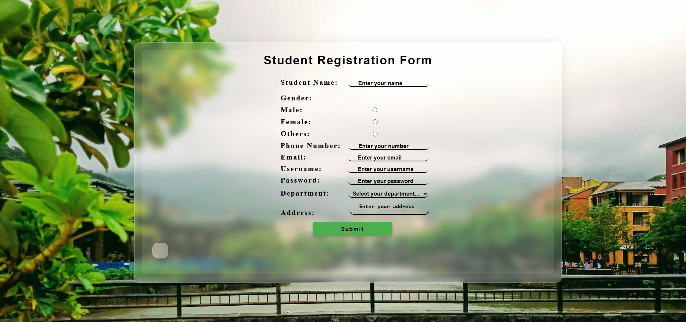
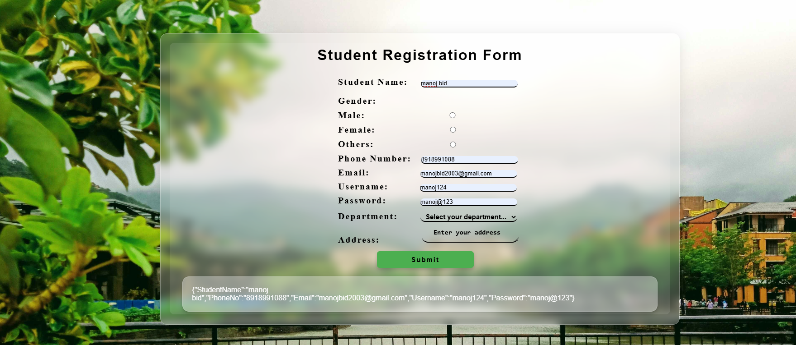

<h1 align ="center">REACT FORM</h1>
<h2><a href="https://mmjtechnologies.netlify.app/" target="_blank">Website Link</a></h2>

 <h3  align ="center"><b>Student Registration Form using React</b></h3>
  

It is a student registration form using useState Hook in react with a beautiful glass background effect and the data of the form will show below as a JSON format.

<ul>
 <li>Data of the form in JSON Format</li> 
   
</ul>
<ul>
 <h2><b> Hooks </b></h2>
 <li>useState</li>
 <h1><b>Programing Languages<b></h1>
<h2><b>Front-End</b></h2>
<li>HTML5</li>
 <li>CSS3</li>
  <li>React js</li>
</ul>
<ul>
<h2><b> Back-End </b></h2>
 <li>Node js</li>
</ul>

